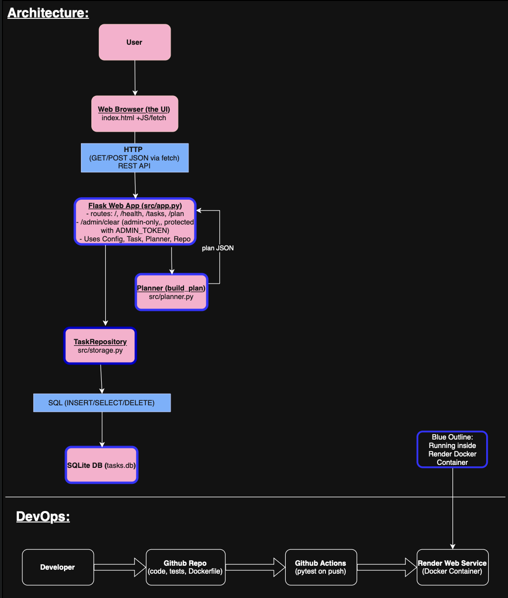

# StudyPlanner – Case Study

## 1) Executive Summary

**Problem:** Today, college students often have numerous overlapping assignments, all of which feel like they must be submitted in a certain way. Couple that with an average college student’s schedule, especially at UVA, and it becomes hard to keep track on what to work on whenever the time presents itself, while being deadline conscious, as well as recognizing how much work the assignment will be- something that doesn’t necessarily come through on an average agenda or planner. This project aims to target individual students who want a concrete plan, mapped out day by day, instead of dealing with an extensive and often vague to do list.  

**Solution:** StudyPlanner is a small web app and REST API that transforms a list of upcoming tasks (categorized by name, deadline, estimated hours, difficulty) into a concrete study schedule, able to go up to three weeks in advance. The user enters the assignments in a simple browser UI, which the backend validates and stores in SQLITE, and runs a scheduling algorithm that spreads the work across upcoming days, while recognizing that no student can study for an entire day straight. It is set to allow for substantial studying per day, but this was chosen thinking students would mostly want to use it during finals or midterms. The app can be run locally in Docker or deployed to the cloud via Render for easy access, as well as demoing. 


## 2) System Overview

**Course Concept(s)**

* **RESTful Web Services** (Flask API with JSON endpoints)
* **Scheduling / Optimization heuristic** (greedy task allocation with priorities)
* **Containerization & Cloud Deployment** (Docker + Render)
* **Configuration via Environment Variables**
* **Automated Testing & CI** (pytest + GitHub Actions)

**Architecture Diagram**

* File: `assets/architecture.png`
* Embedded in README as:




The diagram shows:

* User → Browser UI (`index.html` + JS `fetch`)
* Browser → Flask REST API over HTTP (GET/POST JSON)
* Flask app (`src/app.py`) calling:

  * `Task` model (`src/models.py`, Pydantic)
  * `build_plan` scheduling logic (`src/planner.py`)
  * `TaskRepository` for persistence (`src/storage.py`)
* SQLite database (`tasks.db`) storing tasks
* DevOps flow: Developer → GitHub Repo → GitHub Actions (pytest) → Render Web Service (Docker container)

**Data / Models / Services**

* **Task data model (Pydantic)**

  * Fields: `id`, `course`, `name`, `deadline`, `est_hours`, `difficulty`
  * Validation: non-empty strings, positive hours, difficulty 1–5, ISO dates.
* **Database**

  * Engine: SQLite
  * File: `tasks.db` (local) or `/app/tasks.db` in container
  * Schema: single `tasks` table with columns for each Task field
  * Size: small, single-user; grows linearly with number of tasks.
  * License: SQLite is public domain.
* **Backend Service**

  * Framework: Flask
  * Endpoints:

    * `GET /` – serves HTML frontend
    * `GET /health` – health check
    * `GET /tasks` – list tasks as JSON
    * `POST /tasks` – create task from JSON body
    * `GET /plan` – compute schedule for next N days
    * `POST /admin/clear` – admin-only helper that wipes tasks
* **Frontend**

  * Static HTML + CSS + vanilla JS (`templates/index.html`)
  * Interacts with API via `fetch` calls to `/tasks` and `/plan`.
* **Configuration (env vars via `src/config.py`)**

  * `MAX_HOURS_PER_DAY` – per-day study cap (default 5)
  * `PLANNING_HORIZON_DAYS` – number of days to plan ahead (default 7)
  * `DB_PATH` – SQLite path (default `tasks.db`)
  * `ADMIN_TOKEN` – secret token to authorize `/admin/clear`.

---

## 3) How to Run (Local)

**Docker**

From the project root:

```bash
# build
docker build -t studyplanner:latest .

# run (uses defaults baked into Dockerfile or overridden by .env)
docker run --rm -p 8080:8080 --env-file .env studyplanner:latest

# health check (optional)
curl http://localhost:8080/health
```

Then open the UI in a browser:

```text
http://localhost:8080/
```

> Note: `.env` can set `MAX_HOURS_PER_DAY`, `PLANNING_HORIZON_DAYS`, `DB_PATH`, and `ADMIN_TOKEN`. An example is provided in `.env.example`.

---

## 4) Design Decisions

**Why this concept?**

* **Flask REST API + HTML frontend**

  * Lightweight and easy to understand for a single-student planner.
  * Seperation between simple UI for user, clean backend API.
* **Greedy scheduling algorithm** (`build_plan`)

  * Algorithm creates a priority score based on difficulty, estimate hours needed, and how many days available until the deadline, which then allocates hours day by day using this algorithm. 
  * Was chosen because it’s simple, fast, and explainable, yet can still understand and recognize urgency/workload. 
* **SQLite for storage**

  * No external dependency, easy to bundle in Docker, and is great to use for a single user or small demonstration. 
* **Docker + Render**

  * Demonstrates full containerized deployment path, without the need for infrastructural ownership. 
  * Matches the course goals, specifically around reproducible environments and deployment to the cloud. 

**Alternatives considered**

* **More complex optimization**

  * Overkill for smaller number of tasks, would also add complexity and make it harder to explain. 
* **SPA frontend (React, Vue)**

  * Costs money, as well as the fact that plain HTML and JS work just fine, and are easier to debug. 

**Tradeoffs**

* **Performance vs. simplicity**

  * Greedy algorithm isn’t necessarily globally optimal, but runs O(n*d), for n tasks and d days which is more than needed to operate with student workloads. 
* **Cost vs. durability**

  * Able to use Render’s free tier for deploying, but at a tradeoff of spin down on host and latency with cold starts. 
  * SQLite file in container is simple, but not great for multi-instance scaling. 
* **Maintainability**

  * The maintainability of the code being organized into config.py, models.py, storage.py, planner.py, app.py, and tests allows for a clear separation of concerns. 
  * For new developers, like me, using plain dependencies like flask, pydantic, and pytest allowed me to get into it quicker, and understand it better. 

**Security / Privacy**

* **Secrets management**

  * The `ADMIN_TOKEN` is read from environment variables, not hard-coded. 
  * On Render, it is configured in service environment settings, and not commit to Git. 
* **Admin endpoint**

  * `/admin/clear` requires a valid `ADMIN_TOKEN` via header or query parameter before calling `repo.clear_all()`.
  * Intended for the project owner to reset the demo; not exposed in the public UI.
* **Input validation**

  * `Task` uses Pydantic to enforce valid strings, date formats, positive hours, and difficulty bounds.
  * API checks for required fields and returns meaningful 400 errors on bad input.
* **PII handling**

  * The system stores only course names and task titles, not grades, IDs, or sensitive information.
  * If it were to be deployed for multi-user applications, additional authentication and encryption at rest would be needed/required.

**Ops (Logging, scaling, limitations)**

* **Logging**

  * Built-in logging records in Flask keep track of key events like task creation and plan generation.
  * Render’s dashboard shows live logs of GET/POST requests as well as health checks. 
* **Scaling**

  * Designed to be used by a single student, therefore SQLite and a single container were sufficient. 
  * For scaling to many users, a shared external database, auth and per-user task separation, as well as maybe a more complexed scheduler would be needed in the architecture. 

* **Known limitations**

  * The Free Render account can sleep, and cause cold start delays up to 50 seconds. 
  * There are no user accounts, meaning all tasks are shared. 
  * The Planner assumes every day is identical for study hours available, not accounting for energy, overlapping exams, or having days more/less busy than others.

---

## 5) Results & Evaluation

**Screenshots / Sample Outputs**

All images are stored in `/assets` and referenced from the README:

* `assets/ui.png` – Browser UI showing task form and generated plan side-by-side.
* `assets/plan-json.png` – Example JSON from `GET /plan`.
* `assets/health-curl.png` – Sample `curl` health check.

Example plan JSON (abridged):

```json
{
  "days": [
    {
      "date": "2025-12-01",
      "total_hours": 2.0,
      "sessions": [
        {
          "task_id": 1,
          "course": "ASTRO",
          "name": "Quiz 3",
          "hours": 2.0,
          "deadline": "2025-12-02"
        }
      ]
    },
    ...
  ]
}
```

**Performance / Footprint**

* Base image: `python:3.11-slim`
* Single container, small memory footprint (hundreds of MB)
* Response times for plan generation are effectively instantaneous for typical student workloads (dozens of tasks).

**Validation / Tests**

* Test suite: `pytest`

  * `tests/test_planner.py`

    * Confirms that the planner allocates all required hours for a single task.
    * Confirms that tasks outside the planning time are ignored and a helpful message is returned.
  * `tests/test_api_smoke.py`

    * `test_health_endpoint`: checks that `GET /health` returns 200 and `{"status": "ok"}`.
    * `test_create_task_and_get_plan`: posts a task, then requests a plan and asserts that hours are allocated.
* CI: GitHub Actions workflow (`.github/workflows/ci.yml`)

  * Runs `pytest` on each push to `main`.
  * Only after tests pass is the repository used to build/deploy the container on Render.

---

## 6) What’s Next

Planned improvements and stretch ideas:

* **User accounts & multi-user support**

  * Add authentication for users, as well as per-user task storage. This would allow multiple students to use the same service safely, and have their tasks private.
* **Richer scheduling model**

  * Would allow students to specify their preferred study schedules, as well as non-negotiable days they could not study, and add maximum hours per course, which would be in addition to the per day limit.
  * Explore more advanced optimization techniques, to allow for more heavily loaded/busier schedules, as well as adding space for other activities outside of school work.
* **Calendar integration**

  * Have it be exportable to Apple's calendar app, Microsoft's, or Googles (all three would be ideal).
* **Frontend enhancements**

  * Enhance visual aesthetics, and add a calendar or timeline view instead of the plain list.
  * Allow editing and task deletion from inside the UI itself, since it is currently done by the admin
* **Analytics & feedback**

  * Log data on how often users complete tasks on time, and keep that in mind for the Greedy algorithm. The more you use, the better it would be.

---

## 7) Links

* **GitHub Repo:** [https://github.com/GriffBerry/StudyPlanner](https://github.com/GriffBerry/StudyPlanner)
* **Public Cloud App (Render):** [https://studyplanner-ggq3.onrender.com](https://studyplanner-ggq3.onrender.com)
